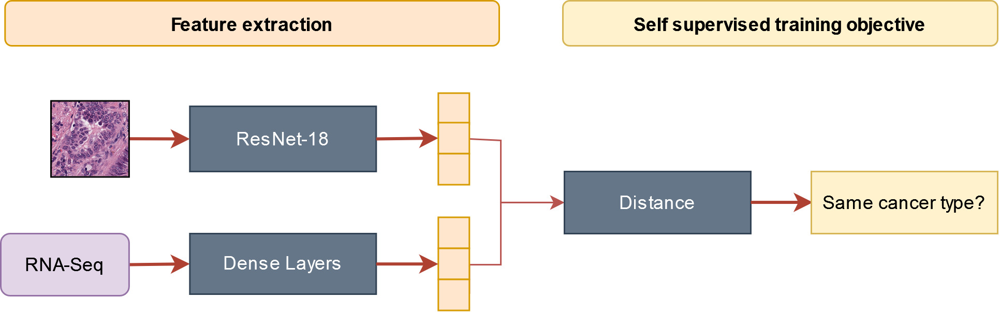

# Self-supervised multimodal pre-training for lung adenocarcinoma overall survival prediction

**Francisco Carrillo-Perez<sup>1,2,*</sup>, Marija Pizurica<sup>1,3,*</sup>, Ignacio Rojas<sup>1</sup>, Kathleen Marchal<sup>3</sup>, Luis Javier Herrera<sup>2</sup> and Olivier Gevaert<sup>1,4</sup>**

**<sup>1</sup> Stanford Center for Biomedical Informatics Research (BMIR), Stanford University, School of Medicine**

**<sup>2</sup> Department of Architecture and Computer Technology (ATC), University of Granada**

**<sup>3</sup> Internet technology and Data science Lab (IDLab), Ghent University**

**<sup>4</sup> Department of Biomedical Data Science, Stanford University, School of Medicine**

**<sup*</sup> These authors contributed equally**

Presented in the BIOCOMP'22 - The 23rd Int'l Conf on Bioinformatics & Computational Biology, Las Vegas, July 2022.

[Manuscript (coming soon!)]()

---

### Abstract

The collection of multiple modalities of cancer data has increased over the years, allowing research in complex problems such as cancer prognosis. However, given the high-dimensionality of biological data, efficiently training machine learning models when scarce samples are available is still challenging. In this work we propose a novel multimodal self-supervised learning framework based on neural networks for survival analysis and we evaluate it in a few-shot learning setting for lung adenocarcinoma prognosis. We show that the multimodal self-supervised pre-training is more effective than regular pre-training or training from scratch for two modalities (RNA-Seq and Whole Slide Imaging) when few samples are available. With the multimodal self-supervised learning framework, the relation between the modalities is learned in a pretext task and the leveraged information is successfully used for the relevant downstream task for both modalities, showing the potential of the proposed methodology.



### Citation

```
```
